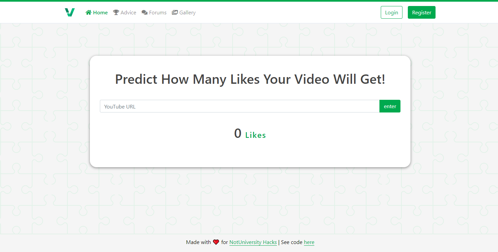

<p align="center">

</p>

<h1 align="center">ViralCheck</h1>  

<p align="center">
This project was done for the NotUniversity Hacks Hackathon, a competition geared towards High School students and under. Due to the recent situation with the Pandemic and the large amount of free time available to most students and young adults, we thought we should try and do our part on delivering a positive difference. That’s why we created ViralCheck, to provide a social media experience for aspiring business people looking for a platform to share ideas, find inspiration, and even get creative with some of the machine learning features. 
</p>

<p align="center">
A link to our devpost submission can be found here: https://devpost.com/software/viralcheck-social-media-app 
</p>

<p align="center">
A link to a small demo of the apps purpose and functionality can be seen here: https://youtu.be/3txJLnwXW24 
</p>

<p align="center">
A link to the current hosted version can be found here: https://viralcheck-1.aahmad4.repl.co/ (Keep in mind that the machine learning model can't be hosted on repl due to its file size so this just has the full UI and login-functionality aspect without the ml)
</p>

## Screenshot Of Home Page


## An Overview Of The Completed Product

Our project consists of a web-app, whose main feature is predicting the how well a YouTube video will do once published, based on past and current data such as the subscriber count, title of the video, and average views. The user has to simply enter the URL of the video, and our app will automatically extract the required data, using the Youtube API v3. The other features of our web-app include a forums page to allow users with accounts to post questions, ideas, and answers, as well as a thumbnail gallery. We also built a login and registration system, so that users can create accounts and post in the forums. On top of this, we have a special section to allow logged in users to adjust their credentials if they wish and even customize their own profile pictures.

## Features

* User authentication
   * Login system
   * Registration system
   * Cryptography
   * Automated forgot password email responses
   * Users can customize their profile settings with updated credentials and personalization
* Machine Learning
   * Uses models built with TensorFlow, Keras, and Scikit Learn to detect how many likes a YouTube video will get
   * Currently working on a thumbnail detector
* Databases
   * Uses a Postgres database to store user accounts, allow users to create new posts to forumns, and share new thumbnail and video          content ideas
   
## How we built it

#### The Machine Learning Model
The model takes data from the video and the youtube channel as input (such as subscriber count, average view count of the channel, number of comments, current view count, time of uploading etc.), and outputs the expected number of likes the video will get. For this prediction, we used a python-based Random Forester Regressor classifier, implemented using the sklearn library and trained using a dataset extracted from Youtube’s 8M dataset. To save the model after training, we used a .pickle file. 

#### The Youtube API
We wanted to make our app such that the user can predict the number of likes using only the URL of the video. For doing this, we first extracted the unique video-id from the URL. Then, we used this id to get the rest of the data using the Youtube API v3. We then fed this data into our ML model.

#### Front-end
The front-end of the web app itself is using templates with HTML and CSS. We used the library Bootstrap and Semantic UI for responsiveness and some native design. We used some JavaScript on top of this for the counting up animation when printing out the number of predicted likes.

#### Back-end and hosting
We used Flask and PostgreSQL for the back-end / databases as well as encryption libraries like Bcrypt to secure users passwords. We're currently working on hosting with Micrsoft Azure, but the most recent version is hosted on a Repl. The back-end also is what allows users to login / register accounts. There is a forgot password feature that will send an email to the users email to reset their password. Logged in users can also adjust their credentials and profile pictures in settings. Logged in users are able to post to forumn and respond to questions / messages. 

## Built With

* [Python 3.7.7](https://www.python.org/)
   * [Flask](https://flask.palletsprojects.com/)
   * [NumPy](https://numpy.org/)
   * [Pandas](https://pandas.pydata.org/)
   * [Pillow](https://pillow.readthedocs.io/)
   * [Requests](https://requests.readthedocs.io/en/master/)
   * [Scikit Learn](https://scikit-learn.org/)
   * [TensorFlow](https://www.tensorflow.org/)
   * [Keras](https://keras.io/)   
   * [SciPy](https://www.scipy.org/)
   * [Urllib3](https://urllib3.readthedocs.io/en/latest/)
   * [PostgreSQL](https://www.postgresql.org/)
   * [YouTube Data API v3](https://developers.google.com/youtube/v3)
* [CSS3](https://developer.mozilla.org/en-US/docs/Archive/CSS3#:~:text=CSS3%20is%20the%20latest%20evolution,flexible%20box%20or%20grid%20layouts.)
   * [Bootstrap](https://getbootstrap.com/)
   * [Semantic UI](https://semantic-ui.com/)
* [JavaScript](https://www.javascript.com/)
* [HTML5](https://developer.mozilla.org/en-US/docs/Web/Guide/HTML/HTML5)

## Model
Since our model was too large to upload directly on GitHub (1 Gig), we decided to upload it on dropbox and leave a link if someone wants to download and test out our app. Simply download this model and put it in the same directory as the predict.py file. Download the model pickle file here: https://www.dropbox.com/s/g2sqw4l2yoqufr8/model-final?dl=0.

## Clone
```
git clone https://github.com/aahmad4/ViralCheck-Social-Media-App
```

## Installation

Use the package manager [pip](https://pip.pypa.io/en/stable/) to install the required packages.

```bash
pip install -r requirements.txt
```

## Usage
```
python main.py
```
Then go to 
```
localhost:8080
```

## Contributing

Pull requests are welcome. For major changes, please open an issue first to discuss what you would like to change.

Please make sure to update tests as appropriate.
